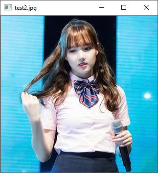
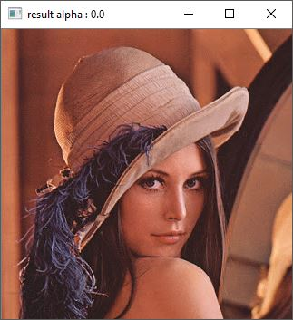
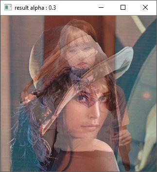
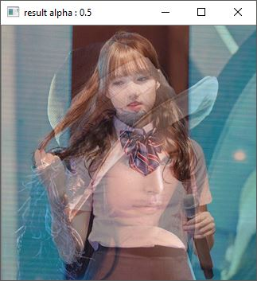
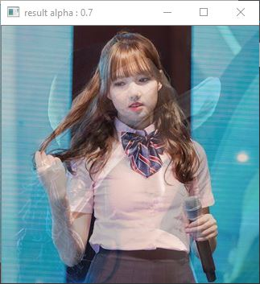

# opencv mat 데이터 조작
opencv에서는 일반적으로 컬러이미지를 BGR로 표현합니다.
BGR = BlueGreenRed

#### 픽셀 색상 가져오기
```c++
Mat img = imread("test.jpg");
Vec3b color = img.at<Vec3b>(x, y);
std::cout << color;

```

#### 픽셀 색상 설정
```c++

img.at<Vec3b>(x, y) = Vec3b(blue_value , green_value , red_value);
img.at<Vec3b>(x, y) = Vec3b(255 , 0 , 0); // set blue
img.at<Vec3b>(x, y) = Vec3b(0 , 255 , 0); // set green
img.at<Vec3b>(x, y) = Vec3b(0 , 0 , 255); // set red

```
#### 가산

```c++
img.at<Vec3b>(x, y) += Vec3b(blue_value , green_value , red_value);
```

#### 감산

```c++
img.at<Vec3b>(x, y) -= Vec3b(blue_value , green_value , red_value);
```
#### 알파 블렌딩


$$
G(x) = (1-\alpha)f_1(x )  + \alpha f_2(x)
$$


위 수식에서 G(x)는 알파 블렌딩된 이미지

f는 원래의 이미지 이다.

알파값과  첫번째 이미지의 농도는 반비래하고

알파값과 두번째 이미지는 비례한다.

알파값이 낮으면 첫번째 이미지가 뚜렸하고 두번째 이미지가 흐려진다.

반대로 알파값이 높으면 두번째이미지가 뚜렸하고 첫번째이미지가 흐려진다.


이것을 코드를 옴기면

```c++
img_result.at<Vec3b>(x, y) = (1 - alpha) * img.at<Vec3b>(x, y) +  alpha * img2.at<Vec3b>(x,y);
```

## 결과













sample code from  github [https://github.com/dabinl1258/ng82_opencv/tree/master/test_code/alpha_test](https://github.com/dabinl1258/ng82_opencv/tree/master/test_code/alpha_test)