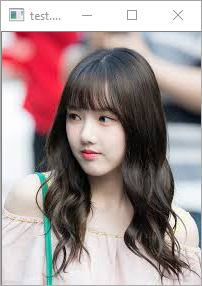
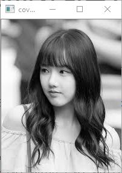
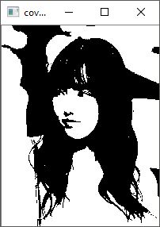

# Grey Scale 이미지 만들기
opencv에서는 BGR을 사용합니다.

$$
G(x) = \frac {B(x) + G(x) + R(x) }{3}
$$


G(x):  그레이스케일 이미지 , B(x) : 블루 , G(x) : 그린 , R(x) :레드


```c++
Vec3b vec = img.at<Vec3b>(x, y);
result.at<uchar>(x, y) = (vec.val[0] + vec.val[1] + vec.val[2]) / 3;
```

### binary Grey Scale


$$
GB(x) = \\
 \ \ \ \ \ \ \ \ \ \ \  \ \ \ \ \ \ \ \ \ \ \ \ \ \ G(x)  < 0.5  => 0  \\
\ \ \ \  \  \ ow :  1
$$

```c++
Vec3b vec = img.at<Vec3b>(x, y);
result.at<uchar>(x, y) = (vec.val[0] + vec.val[1] + vec.val[2]) / 3;
```
밝기가 0.5이상이면 1 아니면 0 으로 검은색과 흰색 2가지만으로 이미지를 표현합니다.







sample code from github [https://github.com/dabinl1258/ng82_opencv/tree/master/test_code/grey_test](https://github.com/dabinl1258/ng82_opencv/tree/master/test_code/grey_test)

