# opencv를 visual studio에서 사용하는 방법에 대하여 알아 봅시다.

## index
1. [index](index)
2. [opencv다운로드](opencv다운로드)
3. [opencv압축해제](opencv압축해제)
4. [visual studio c++ 프로젝트 생성](visual studio c++ 프로젝트 생성)
5. [visual studio 프로젝트 속성 설정](visual studio 프로젝트 속성 설정)


## opencv다운로드
opecv는 https://opencv.org/releases.html 에서 Win pack를 누릅니다.
그럼 sourceforge에서 opencv를 다운받게 됩니다.

## opencv압축해제
다운받은 opencv를 실행시켜서 적절한 폴더를 설정하고 압축을 풉니다.

## visual studio c++ 프로젝트 생성
다음과 같이 비쥬얼 스튜디오에서 빈 c++ console 프로젝트를 만듬니다.
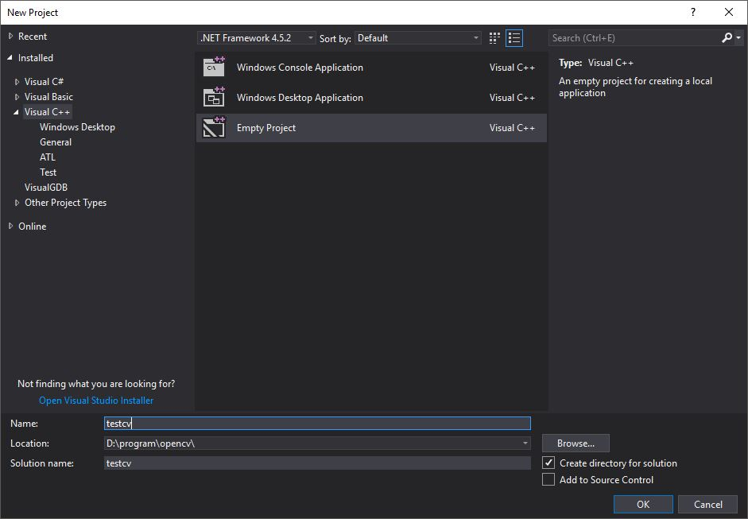
소스파일을 추가합니다.
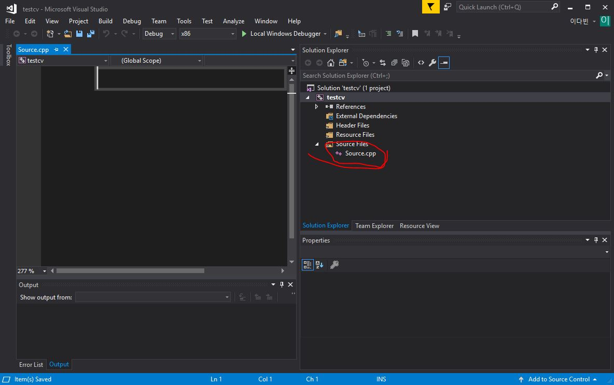

## visual studio 프로젝트 속성들(properties) 설정
visual studio 속성을 설정하기 위하여 다음과 같은 설정이 필요합니다.
프로젝트
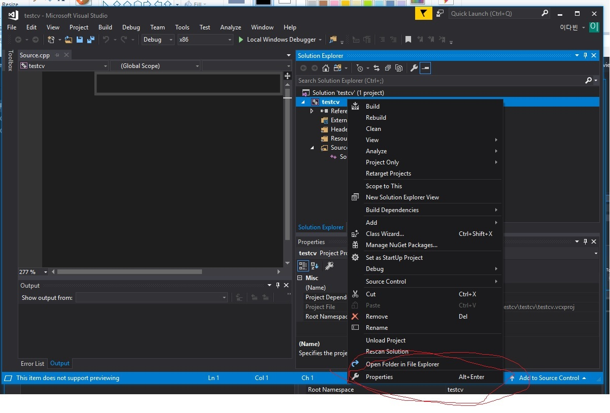

## 64bit 설정
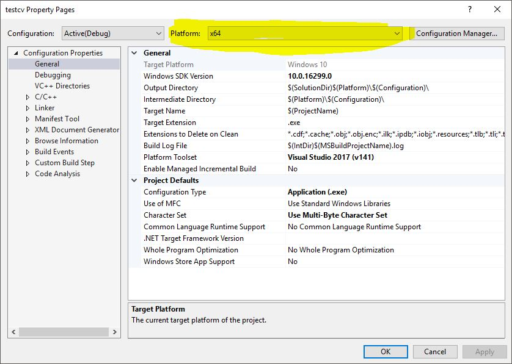
##  추가 포합 디렉토리 (additional indclude directories) 설정
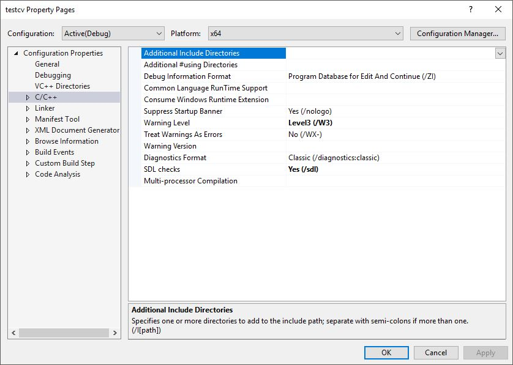
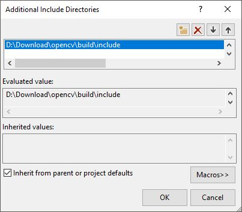
opencv\build\include 경로는 이전에 압축 풀었던 경로
##  추가 라이브러리 디렉토리 (additional library directories) 설정
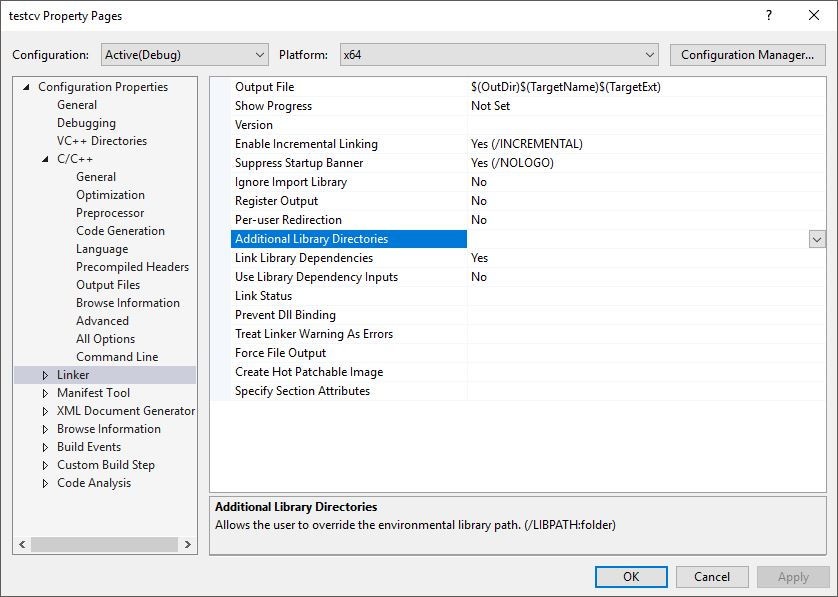
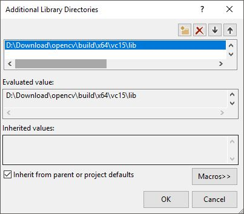
##  링커 input 설정
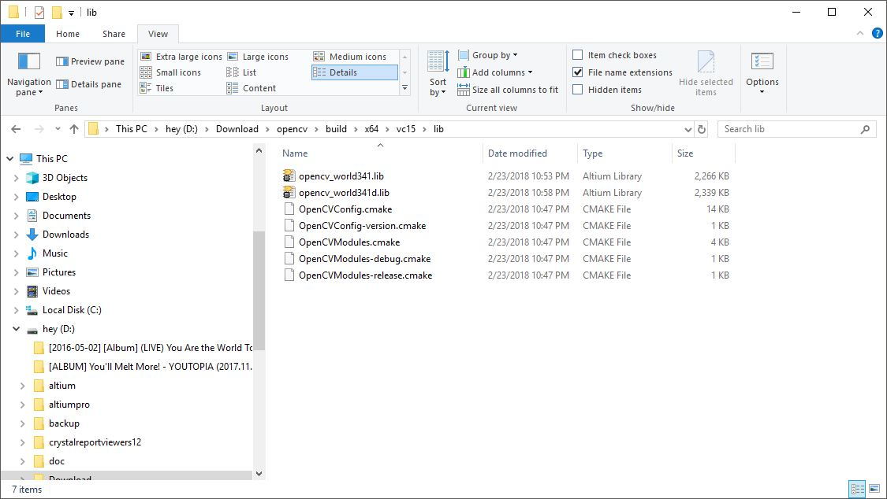
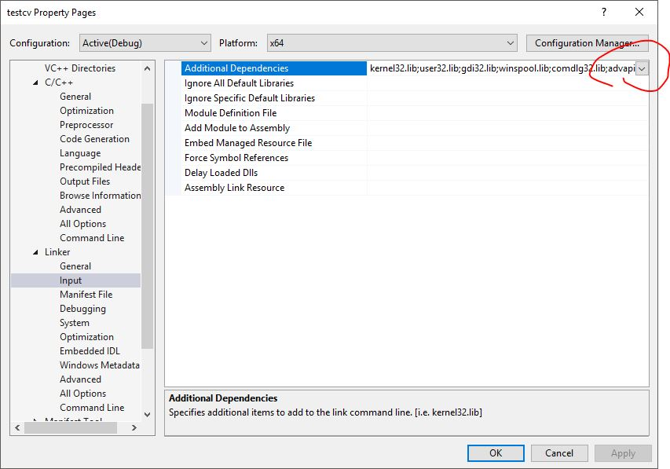
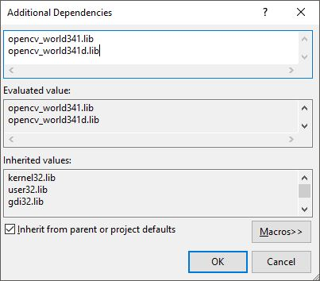
추가한 라이브러리 디렉토리에 있는 lib파일 이름입력
## 환경설정
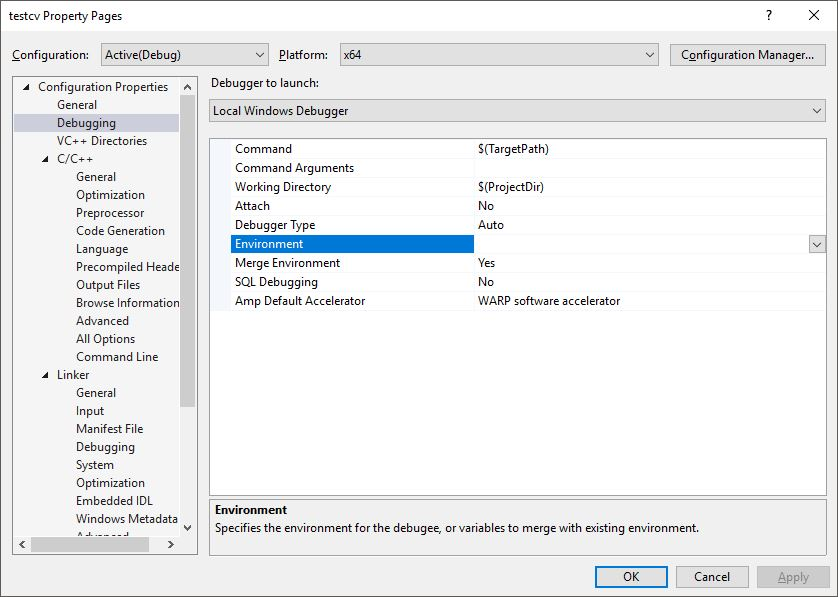
PATH=D:\Download\opencv\build\x64\vc15\bin;$PATH$
같이 중간에 D:\Download\는 각자 압축푼 폴더
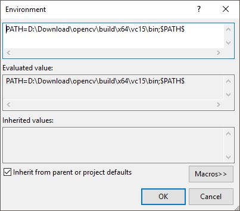

## 테스트 코드 실행
```c++
#include <opencv2/highgui.hpp>

int main()
{
	cv::Mat img = cv::imread("test.jpg");
	cv::namedWindow("test.jpg", cv::WINDOW_AUTOSIZE);
	cv::imshow("test.jpg", img);
	cv::waitKey(0);
	return 0;
}
```
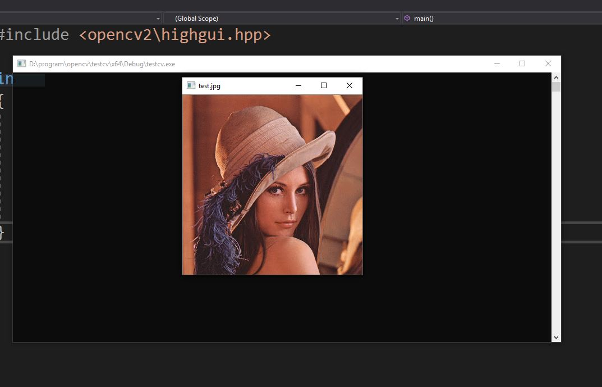

아래 링크에서 다운 받을 수 있습니다.
from git [https://github.com/dabinl1258/ng82_opencv/tree/master/test_code/test](https://github.com/dabinl1258/ng82_opencv/tree/master/test_code/test)

